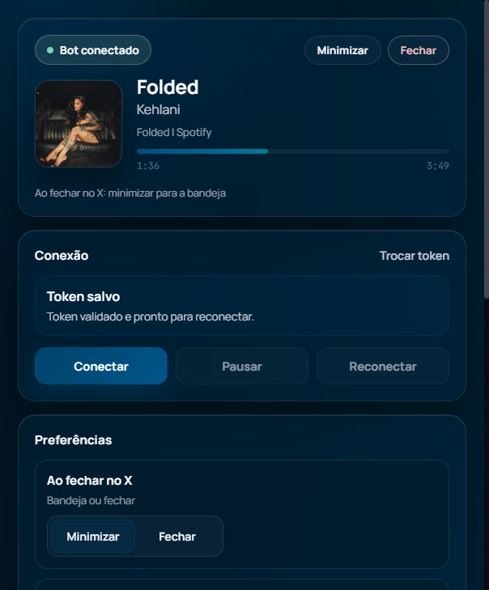
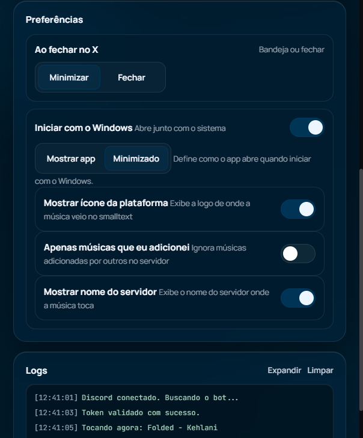
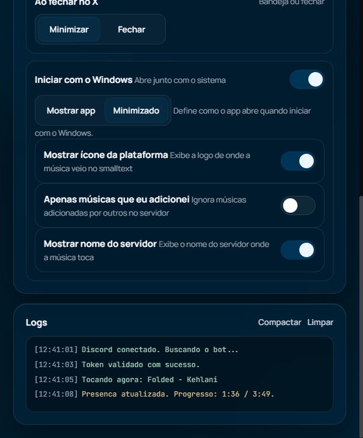

# Andrey RPC

Aplicativo oficial para exibir no Discord o que você está ouvindo no Andrey Bot, com foco em estabilidade, privacidade local e experiência limpa.

## Adicionar o Andrey

- [Adicionar o Andrey ao seu servidor](https://discord.com/oauth2/authorize?client_id=1411856393518190702)

## Preview

## O que o app faz

- Mostra sua música atual no Discord em tempo real.
- Atualiza capa, título, artista e origem da faixa.
- Limpa automaticamente o status quando pausar, desconectar ou ocorrer erro.
- Reconecta sozinho quando Discord ou conexão oscilam.
- Permite minimizar para bandeja e iniciar com o Windows.

## Como obter o token RPC

Use o comando slash `/rpc` no Andrey para gerar e copiar seu token RPC.

Se você ainda não tiver o bot no servidor:

- [Adicionar o Andrey ao Discord](https://discord.com/oauth2/authorize?client_id=1411856393518190702)

## Segurança em detalhes

Este projeto foi desenhado para reduzir superfície de ataque e evitar comportamentos inseguros comuns em apps Electron.

- O processo de interface roda com isolamento habilitado (`contextIsolation`) e ambiente isolado (`sandbox`).
- O acesso direto a APIs Node no renderer fica desativado (`nodeIntegration: false`).
- Navegação externa e abertura de janelas não autorizadas são bloqueadas.
- A comunicação entre interface e processo principal (IPC) é validada por origem local confiável (`file://`).
- O renderer usa política de segurança de conteúdo (CSP) para restringir fontes de script, conexão, fontes web e mídia.
- Logs na interface são renderizados com `textContent` (sem `innerHTML`) para mitigar injeção de conteúdo.
- URLs usadas no Rich Presence passam por validação para evitar payload inválido ou malicioso.

## Como os dados são tratados

- O token RPC é usado para autenticar sua sessão de presença.
- O app salva preferências locais para facilitar reconexão e comportamento da janela.
- O aplicativo não exige login de conta Discord nem senha.
- O foco é funcionamento local do cliente com comunicação ao endpoint oficial do bot.

## Boas práticas para uso seguro

- Baixe somente da página oficial de Releases.
- Prefira sempre binários assinados nas publicações oficiais.
- Evite executar versões recebidas por terceiros, mirrors ou links encurtados.
- Mantenha Discord e sistema operacional atualizados.

## Limitações e transparência

- Nenhum software é 100% imune a falhas.
- Certificado digital e assinatura melhoram confiança de origem, mas não substituem verificação do usuário.
- Se notar comportamento suspeito, interrompa o uso e reporte pelo canal oficial.

## Download

Baixe sempre pela página oficial de Releases deste repositório:

- [Releases](https://github.com/realkalashnikov/andrey-rpc/releases)
- [Adicionar o Andrey ao Discord](https://discord.com/oauth2/authorize?client_id=1411856393518190702)

## Aviso legal importante

Este projeto e seu código-fonte são proprietários.

Não é permitido, sem autorização expressa e por escrito do autor:

- usar este código (total ou parcial) para qualquer finalidade
- copiar, modificar, redistribuir ou republicar este projeto
- utilizar este projeto em produtos, serviços, bots, apps ou forks
- explorar comercialmente ou para uso pessoal qualquer parte do código

Todos os direitos estão reservados.

## Autenticidade

Se encontrar uma versão distribuída fora deste repositório oficial, trate como não confiável.

Para confirmar autenticidade:

- verifique se o download veio da página oficial de Releases
- valide o autor do repositório
- prefira binários assinados nas publicações oficiais
